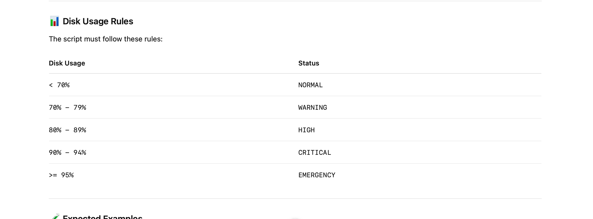

# 🐧 Bash Challenge: Disk Space Alert

## 📌 Problem Statement

You are working as a DevOps engineer and need to create a Bash script that checks the disk usage percentage of a server.

The script should accept the **disk usage percentage as a command-line argument** and determine the appropriate alert level based on the percentage.

Your task is to write a Bash script named:

```text
disk_alert.sh
```
Create a Bash script that:

1. Accepts disk usage percentage as the first command-line argument.
2. Validates the input.
3. Determines the disk usage status.
4. Prints the appropriate status.
5. Handles invalid input gracefully.

example:
```text
./disk_alert.sh 85
```


Your solution should:

* Use Bash.
* Use $1 to read the command-line argument.
* Use conditional logic such as if, elif, and else.
* Validate the input before performing comparisons.
* Correctly handle boundary values such as:
    * 69
    * 70
    * 79
    * 80
    * 89
    * 90
    * 94
    * 95
    * 100
* Return a non-zero exit code when invalid input is provided.

This challenge is designed to practice:

* Bash scripting
* Command-line arguments
* Variables
* if / elif / else
* Integer comparisons
* -lt
* -le
* -gt
* -ge
* Regular expressions or input validation
* Exit codes
* Handling edge cases

Your solution is considered complete when:

* The script accepts disk usage as an argument.
* Values below 70 return NORMAL.
* Values from 70–79 return WARNING.
* Values from 80–89 return HIGH.
* Values from 90–94 return CRITICAL.
* Values 95–100 return EMERGENCY.
* Missing input is handled.
* Non-numeric input is handled.
* Negative values are rejected.
* Values above 100 are rejected.
* Invalid input returns a non-zero exit code.
* Boundary values are handled correctly.

The goal of this challenge is to practice Bash conditional logic and input validation, not just to get the correct output.